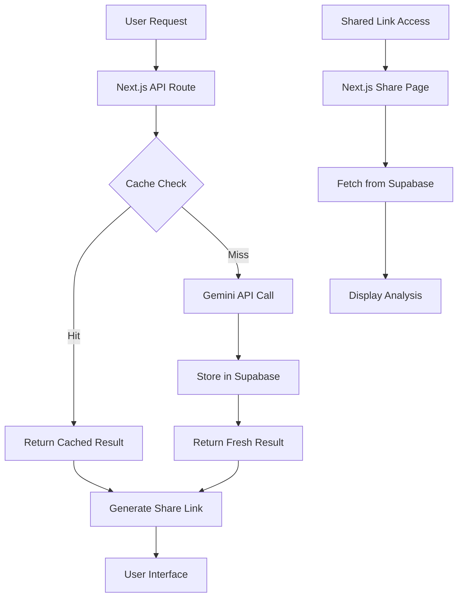

# Design Document

## Overview

The song analysis sharing feature extends the existing Song2Meaning application by adding persistent storage via Supabase and shareable links functionality. The system will cache analysis results to reduce API costs and provide users with unique URLs to share their song analyses. The design leverages Supabase as the primary database for storing analysis results, managing cache lookups, and generating shareable content.

## Architecture

### High-Level Architecture



### Database Schema

The Supabase database will contain the following tables:

**song_analyses**
- `id` (UUID, Primary Key) - Unique identifier for each analysis
- `artist` (TEXT, NOT NULL) - Normalized artist name (lowercase, trimmed)
- `song_title` (TEXT, NOT NULL) - Normalized song title (lowercase, trimmed)
- `original_artist` (TEXT, NOT NULL) - Original artist name as entered by user
- `original_song_title` (TEXT, NOT NULL) - Original song title as entered by user
- `analysis_data` (JSONB, NOT NULL) - Complete analysis result from Gemini
- `created_at` (TIMESTAMP, NOT NULL) - When the analysis was first created
- `updated_at` (TIMESTAMP, NOT NULL) - Last time the record was accessed
- `access_count` (INTEGER, DEFAULT 1) - Number of times this analysis has been accessed
- `share_id` (TEXT, UNIQUE, NOT NULL) - URL-safe unique identifier for sharing

**Indexes:**
- Composite index on `(artist, song_title)` for fast cache lookups
- Index on `share_id` for share link resolution
- Index on `created_at` for recent analyses queries

### Data Flow

1. **Analysis Request Flow:**
   - User submits song analysis request
   - System normalizes artist and song title (lowercase, trim)
   - Check Supabase for existing analysis using normalized keys
   - If found: return cached result, increment access_count, update updated_at
   - If not found: call Gemini API, store result with generated share_id
   - Return analysis with share link to user

2. **Share Link Flow:**
   - User accesses share link with share_id parameter
   - System queries Supabase using share_id
   - If found: display analysis, increment access_count
   - If not found: redirect to home with error message

3. **Popular Songs Flow:**
   - Query Supabase for recent analyses ordered by created_at DESC
   - Return top 10 with artist, title, and access_count
   - Display on home page with links to shared analyses

## Components and Interfaces

### 1. Supabase Client Configuration

**File:** `lib/supabase.ts`
- Initialize Supabase client with environment variables
- Export typed client for use across the application
- Handle connection error scenarios gracefully

### 2. Database Service Layer

**File:** `lib/database.ts`
- `getCachedAnalysis(artist: string, songTitle: string)` - Retrieve cached analysis
- `storeAnalysis(analysisData: AnalysisResult, shareId: string)` - Store new analysis
- `getAnalysisByShareId(shareId: string)` - Retrieve analysis for sharing
- `getRecentAnalyses(limit: number)` - Get popular/recent analyses
- `incrementAccessCount(id: string)` - Update access statistics

### 3. Enhanced Analysis API Route

**File:** `app/api/analyze/route.ts` (Modified)
- Integrate cache checking before Gemini API calls
- Store successful analyses in Supabase
- Return share link with analysis results
- Handle database connection failures gracefully

### 4. Share Link API Route

**File:** `app/api/share/[shareId]/route.ts`
- Retrieve analysis by share_id
- Return analysis data with metadata
- Handle invalid share IDs appropriately

### 5. Share Page Component

**File:** `app/share/[shareId]/page.tsx`
- Server-side rendering of shared analysis
- SEO-optimized meta tags with song information
- "Analyze Another Song" call-to-action
- Social sharing buttons

### 6. Enhanced Home Page

**File:** `app/page.tsx` (Modified)
- Add share button to analysis results
- Display popular/recent analyses section
- Integrate clipboard functionality for share links

### 7. Share Link Generation Utility

**File:** `lib/shareUtils.ts`
- `generateShareId()` - Create URL-safe unique identifiers
- `buildShareUrl(shareId: string)` - Construct full share URLs
- `copyToClipboard(text: string)` - Handle clipboard operations

## Data Models

### Enhanced AnalysisResult Interface

```typescript
interface AnalysisResult {
  songTitle: string;
  artist: string;
  overview: string;
  themes: string[];
  deepDive: string;
  culturalContext: string;
  shareId?: string;
  shareUrl?: string;
  createdAt?: string;
  accessCount?: number;
  fromCache?: boolean;
}
```

### Database Models

```typescript
interface SongAnalysisRecord {
  id: string;
  artist: string;
  song_title: string;
  original_artist: string;
  original_song_title: string;
  analysis_data: AnalysisResult;
  created_at: string;
  updated_at: string;
  access_count: number;
  share_id: string;
}

interface PopularSong {
  original_artist: string;
  original_song_title: string;
  access_count: number;
  share_id: string;
  created_at: string;
}
```

## Error Handling

### Database Connection Failures
- **Cache Lookup Failure:** Continue with fresh Gemini API call, log error
- **Storage Failure:** Return analysis to user, log error, disable share functionality
- **Share Retrieval Failure:** Show user-friendly error, redirect to home

### Invalid Share Links
- Return 404 status for non-existent share IDs
- Redirect to home page with appropriate error message
- Log invalid share ID attempts for monitoring

### Rate Limiting Integration
- Cached results bypass rate limiting
- Fresh API calls still subject to existing rate limits
- Display cache status to users ("Previously analyzed" indicator)

## Testing Strategy

### Unit Tests
- Database service functions with mocked Supabase client
- Share ID generation and validation
- Cache key normalization logic
- Error handling scenarios

### Integration Tests
- End-to-end analysis flow with database storage
- Share link generation and retrieval
- Popular songs query functionality
- Database connection failure scenarios

### Performance Tests
- Cache lookup performance with large datasets
- Database query optimization validation
- Share page loading times
- Concurrent access handling

## Security Considerations

### Data Privacy
- Analysis data contains no personally identifiable information
- Share IDs are cryptographically secure and unpredictable
- No user authentication required for basic functionality

### Database Security
- Use Supabase Row Level Security (RLS) policies
- Limit database access to necessary operations only
- Sanitize all user inputs before database queries

### Share Link Security
- Generate cryptographically secure share IDs (minimum 16 characters)
- Implement rate limiting on share link access
- No sensitive information exposed in URLs

## Performance Optimizations

### Caching Strategy
- Database-level caching for frequently accessed analyses
- Client-side caching of popular songs list
- CDN caching for share pages (static content)

### Database Optimizations
- Composite indexes for fast cache lookups
- Periodic cleanup of old, unused analyses
- Connection pooling for high-traffic scenarios

### Frontend Optimizations
- Lazy loading of popular songs section
- Optimistic UI updates for share button interactions
- Progressive enhancement for share functionality

## Deployment Considerations

### Environment Variables
```
NEXT_PUBLIC_SUPABASE_URL=your-supabase-project-url
NEXT_PUBLIC_SUPABASE_ANON_KEY=your-supabase-anon-key
SUPABASE_SERVICE_ROLE_KEY=your-service-role-key (server-side only)
```

### Database Migration
- Create tables and indexes via Supabase dashboard or CLI
- Set up Row Level Security policies
- Configure database connection limits

### Monitoring
- Track cache hit rates and database performance
- Monitor share link usage patterns
- Alert on database connection failures

This design provides a robust foundation for implementing song analysis sharing with efficient caching, while maintaining the existing application's performance and user experience.